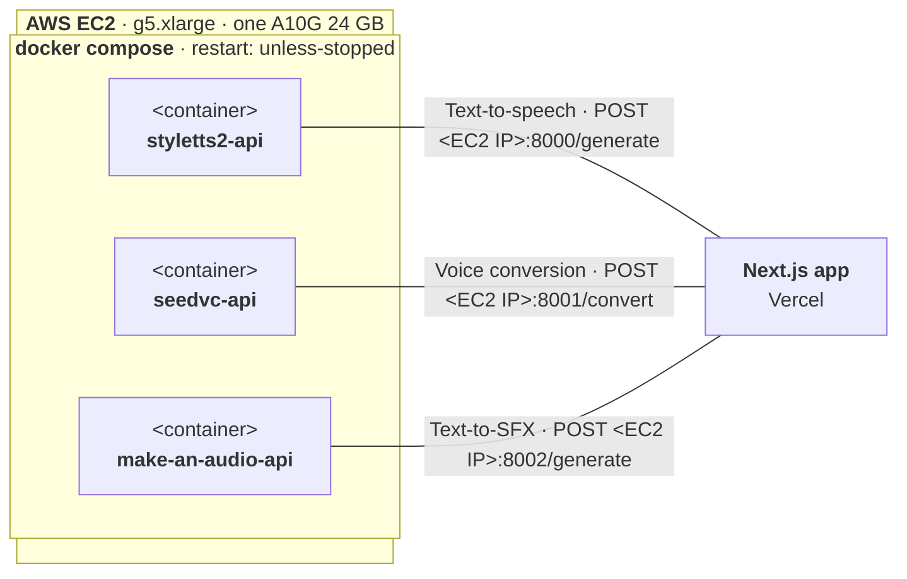
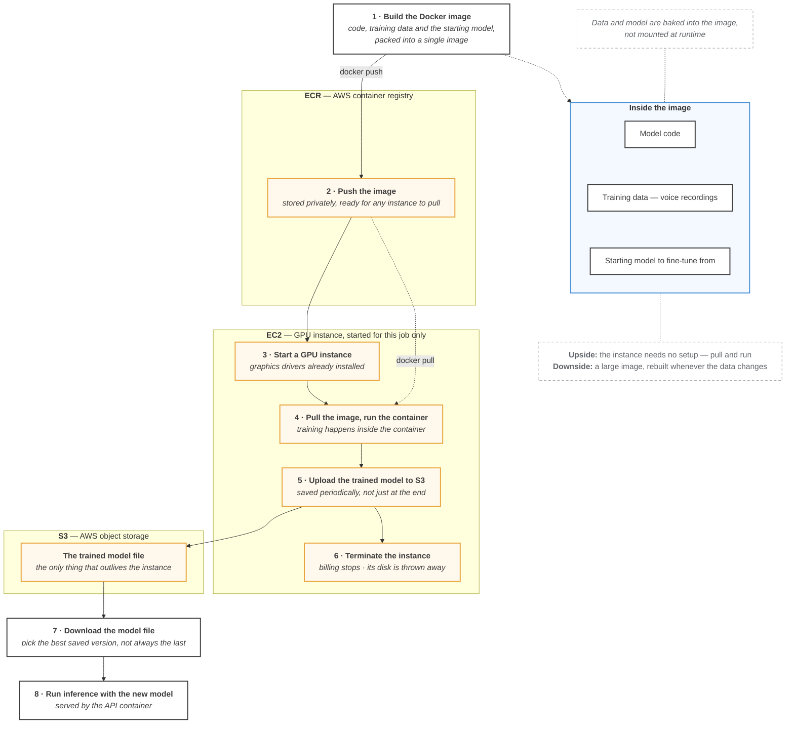

# ToneXLabs: A Full-Stack, Self-Hosted AI Voice Platform

ToneXLabs is a complete, end-to-end AI voice generation platform that replaces external, paid APIs (like ElevenLabs) with a self-hosted, fine-tunable, and scalable solution. This project manages everything from AI model fine-tuning to API deployment and a full-stack user-facing application.

The primary goal is to achieve **full ownership of the AI stack**, enabling deep customization (like fine-tuning specific voices) and removing dependency on third-party services.

## 🚀 Core Features

* **Text-to-Speech (TTS):** Utilizes a fine-tuned `StyleTTS2` model to generate high-quality speech from text in a specific voice.
* **Voice Conversion (VC):** Employs a `seed-vc` model to transform an input audio file into a different target voice.
* **Text-to-Sound Effects (SFX):** Leverages a `make-an-audio` model to generate sound effects from a text prompt.
* **Self-Hosted & Scalable:** The entire AI backend is containerized with Docker and deployed on AWS EC2, complete with a job queue to manage high-load.
* **Deep Customization:** Includes a complete workflow for fine-tuning models on a GPU instance and saving the custom "brains" to S3.

## 🛠️ Tech Stack & Architecture

This project is a full-stack solution, separating the AI backend, cloud infrastructure, and frontend.

| Component | Technology |
| :--- | :--- |
| **Frontend** | Next.js, React, TypeScript, Tailwind CSS |
| **Backend** | Python, FastAPI, PyTorch, Docker, Docker Compose |
| **AI Models** | `StyleTTS2`, `seed-vc`, `make-an-audio` |
| **Cloud (AWS)** | **EC2** (`g5.xlarge` GPU Instance), **S3** (Object Storage), **ECR** (Container Registry), **IAM** (Roles & Policies) |
| **Job Queue** | Inngest (to prevent server overload) |

---

## 🏗️ System Architecture

The system is split into a **Next.js Frontend** (likely hosted on Vercel) and a **Python Backend** running on a single, powerful AWS EC2 instance.

### 1. API Deployment (The "Live" Server)

The core backend runs on a `G5.xlarge` EC2 instance, managed by `docker-compose`. It orchestrates three separate API containers, each serving a specific AI model:

* **`styletts2-api`**: Listens on Port `8000` for Text-to-Speech requests.
* **`seed-vc-api`**: Listens on Port `8001` for Voice Conversion requests.
* **`make-a-sound-api`**: Listens on Port `8002` for Text-to-SFX requests.

The EC2 instance's Security Group is configured to allow public TCP traffic on ports `8000`, `8001`, and `8002` so the Next.js frontend can communicate with each service.




### 2. Application Flows

#### Text-to-Speech (TTS) Flow
1.  **Frontend:** User enters text, selects a voice, and hits "Generate."
2.  **HTTP Request:** The Next.js app sends an HTTP request to `http://<EC2_IP>:8000/generate`.
3.  **Backend:** The `styletts2-api` (FastAPI) receives the request, runs the AI model, and generates a `.wav` file.
4.  **Backend -> S3:** The backend uploads the generated audio file to an `styletts2-outputs` S3 bucket.
5.  **HTTP Response:** The API returns a JSON response to the frontend containing the S3 URL of the new file.
6.  **Frontend:** The app's audio player plays the audio directly from the S3 URL.

 #### Voice Conversion (VC) Flow
1.  **Frontend:** User uploads an audio file (e.g., `my_voice.wav`), selects a target voice, and hits "Generate." The frontend uploads this file directly to an `seedvc-audio-uploads` S3 bucket.
2.  **HTTP Request:** The Next.js app sends an HTTP request to `http://<EC2_IP>:8001/convert`, passing the S3 URL of the newly uploaded file.
3.  **Backend:** The `seed-vc-api` downloads the user's audio from S3.
4.  **Backend:** The `seed-vc` model runs, converting the audio to the target voice.
5.  **Backend -> S3:** The backend uploads the *newly generated* audio file to an `seedvc-outputs` S3 bucket.
6.  **HTTP Response:** The API returns the S3 URL of the converted file.
7.  **Frontend:** The app's audio player plays the new audio from the S3 link.

 #### Text-to-SFX Flow
This flow is identical to the TTS flow, but it uses the `make-an-audio` model on port `8002`.

 ---

## 🧠 Model Fine-Tuning Process

This is a **one-off job** performed to create the custom, fine-tuned model files used by the deployment server.

### Fine-Tuning Data Requirements
* **StyleTTS2:** Requires 10-15 minutes of high-quality, segmented audio (1-10s clips) and a corresponding `.srt` transcription file.
* **seed-vc:** Uses the same 10-15 minutes of audio, but only needs the raw audio files (no transcription required).

### Fine-Tuning Infrastructure Flow
1.  **Local Machine:** The `Dockerfile`, dataset, and model code are "baked" into a "training" Docker image (e.g., `styletts2-ft`).
2.  **Upload to ECR:** This image is pushed to a private **AWS ECR** repository.
3.  **Launch EC2:** A powerful `G5.xlarge` instance is manually started, using a "Deep Learning PyTorch AMI" to ensure all NVIDIA drivers are pre-installed.
4.  **Pull & Run:** The user SSH's into the instance, pulls the image from ECR, and starts the Docker container to begin training.
5.  **Upload Model:** After training, the container uploads the new model file (e.g., `finetuned_model.pth`) to an **AWS S3** bucket (e.g., `styletts2-models`).
6.  **Terminate:** The EC2 instance is terminated to stop all costs.

The "Deployment" server is then configured to download and use this new `.pth` file from S3.




## 🔒 AWS Security Model

Permissions are handled using a standard, secure IAM setup:

* **IAM User (`styletts2-api`):** A long-term user with an access key and secret. It is only used on a **local machine** for administrative tasks like uploading data to S3 from a local script.
* **IAM Role (`tonexlabs-ec2`):** A temporary, more secure set of permissions **attached directly to the EC2 instance.** The application on the server automatically "assumes" this role. This role grants the EC2 instance the necessary permissions to:
    * `ecr:Pull` images from ECR.
    * `s3:PutObject` and `s3:GetObject` to read and write audio files from the S3 buckets.

This avoids the insecure practice of hard-coding secret access keys inside the deployed application.

---

## 🚀 Getting Started

### Prerequisites

* An AWS account with quota for a `g5.xlarge` instance.
* AWS CLI configured on your local machine.
* Docker & Docker Compose.
* Node.js & `npm` / `yarn`.
* Python 3.10+.

### 1. Configuration

You will need to set up your environment variables.

**Frontend (`/frontend`):**
Create a `.env.local` file:
```
NEXT_PUBLIC_TTS_API_URL=http://<YOUR_EC2_IP>:8000
NEXT_PUBLIC_VC_API_URL=http://<YOUR_EC2_IP>:8001
NEXT_PUBLIC_SFX_API_URL=http://<YOUR_EC2_IP>:8002

# Auth.js Config
AUTH_SECRET=...
GITHUB_ID=...
GITHUB_SECRET=...
```

**Backend (`/backend`):**
Create a `.env` file for the Docker Compose environment:
```
# AWS Credentials for the server to access S3/ECR
# (Note: Best practice is an IAM Role, but keys can be used)
AWS_ACCESS_KEY_ID=...
AWS_SECRET_ACCESS_KEY=...
AWS_REGION=ap-south-1

# S3 Bucket Names
TTS_OUTPUT_BUCKET=tonexlabs-styletts2-outputs
VC_UPLOAD_BUCKET=tonexlabs-seedvc-uploads
VC_OUTPUT_BUCKET=tonexlabs-seedvc-outputs
```

### 2. Run Locally (Frontend)

```bash
cd frontend
npm install
npm run dev
```

### 3. Run Locally (Backend)

```bash
cd backend
pip install -r requirements.txt

# Run a single service (e.g., TTS)
uvicorn main_tts:app --host 0.0.0.0 --port 8000
```

### 4. Deploy to AWS

1.  **Build & Push Images:**
    ```bash
    # From the /backend directory
    docker compose build
    docker compose push
    ```

2.  **Run on EC2:**
    * SSH into your configured EC2 instance.
    * Make sure Docker and Docker Compose are installed.
    * Create the `.env` file on the server.
    * Run `docker compose pull` to get your images from ECR.
    * Run `docker compose up -d` to start the services in the background.
